# Architecture Overview

This diagram shows the high-level architecture of witr and how the packages interact.

```mermaid
graph TB
    subgraph "Entry Point"
        CLI["cmd/witr/main.go<br/>CLI Entry Point"]
    end

    subgraph "pkg/model - Data Models"
        Target["Target<br/>(PID | Port | Name)"]
        Process["Process<br/>(PID, PPID, Command, User, etc.)"]
        Source["Source<br/>(Type, Name, Confidence)"]
        Result["Result<br/>(Target, Process, Ancestry, Source, Warnings)"]
        Socket["SocketInfo<br/>(Port, State, Explanation)"]
        Resource["ResourceContext<br/>(Energy, Thermal, Sleep)"]
        FileCtx["FileContext<br/>(Open Files, Locks)"]
    end

    subgraph "internal/target - Target Resolution"
        Resolve["resolve.go<br/>Route by Target Type"]
        PortRes["port_*.go<br/>Resolve Port to PID"]
        NameRes["name_*.go<br/>Resolve Name to PID"]
    end

    subgraph "internal/proc - Process Information"
        Ancestry["ancestry.go<br/>Build Process Tree"]
        ProcRead["process_*.go<br/>Read Process Details"]
        NetRead["net_*.go<br/>Network Sockets"]
        FDRead["fd_*.go<br/>File Descriptors"]
        ResRead["resource_*.go<br/>Resource Context"]
        FileRead["filecontext_*.go<br/>File Context"]
    end

    subgraph "internal/source - Source Detection"
        Detect["detect.go<br/>Source Detection Router"]
        Container["container.go<br/>Docker/Podman/K8s"]
        Systemd["systemd_*.go<br/>Linux Init System"]
        Launchd["launchd_*.go<br/>macOS Init System"]
        Supervisor["supervisor.go<br/>PM2/Gunicorn/etc."]
        Cron["cron.go<br/>Scheduled Tasks"]
        Shell["shell.go<br/>Interactive Shells"]
    end

    subgraph "internal/launchd - macOS Launchd"
        Plist["plist.go<br/>Parse Launchd Plists"]
    end

    subgraph "internal/output - Output Formatting"
        Standard["standard.go<br/>Full Output"]
        Short["short.go<br/>One-liner"]
        Tree["tree.go<br/>Tree View"]
        JSON["json.go<br/>JSON Output"]
        EnvOnly["envonly.go<br/>Env Variables"]
    end

    CLI --> Target
    CLI --> Resolve

    Resolve --> PortRes
    Resolve --> NameRes
    PortRes --> Process
    NameRes --> Process

    CLI --> Ancestry
    Ancestry --> ProcRead
    ProcRead --> Process
    ProcRead --> NetRead
    ProcRead --> FDRead

    CLI --> Detect
    Detect --> Container
    Detect --> Supervisor
    Detect --> Systemd
    Detect --> Launchd
    Detect --> Cron
    Detect --> Shell
    Launchd --> Plist
    Detect --> Source

    CLI --> ResRead
    CLI --> FileRead
    ResRead --> Resource
    FileRead --> FileCtx

    Process --> Result
    Source --> Result
    Socket --> Result
    Resource --> Result
    FileCtx --> Result

    Result --> Standard
    Result --> Short
    Result --> Tree
    Result --> JSON
    Result --> EnvOnly

    style CLI fill:#e1f5fe
    style Result fill:#c8e6c9
    style Detect fill:#fff3e0
    style Ancestry fill:#f3e5f5
```

## Package Responsibilities

| Package | Responsibility |
|---------|---------------|
| `cmd/witr` | CLI entry point, argument parsing, orchestration |
| `pkg/model` | Data structures shared across packages |
| `internal/target` | Resolve user input to process IDs |
| `internal/proc` | Gather process information from OS |
| `internal/source` | Detect what started the process |
| `internal/launchd` | macOS launchd plist parsing |
| `internal/output` | Format and render results |
