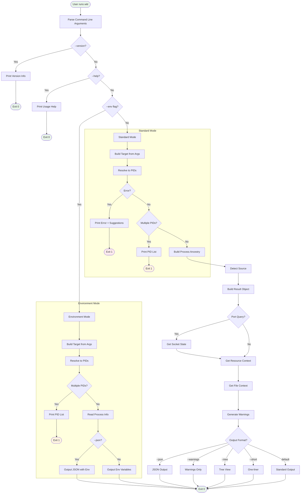
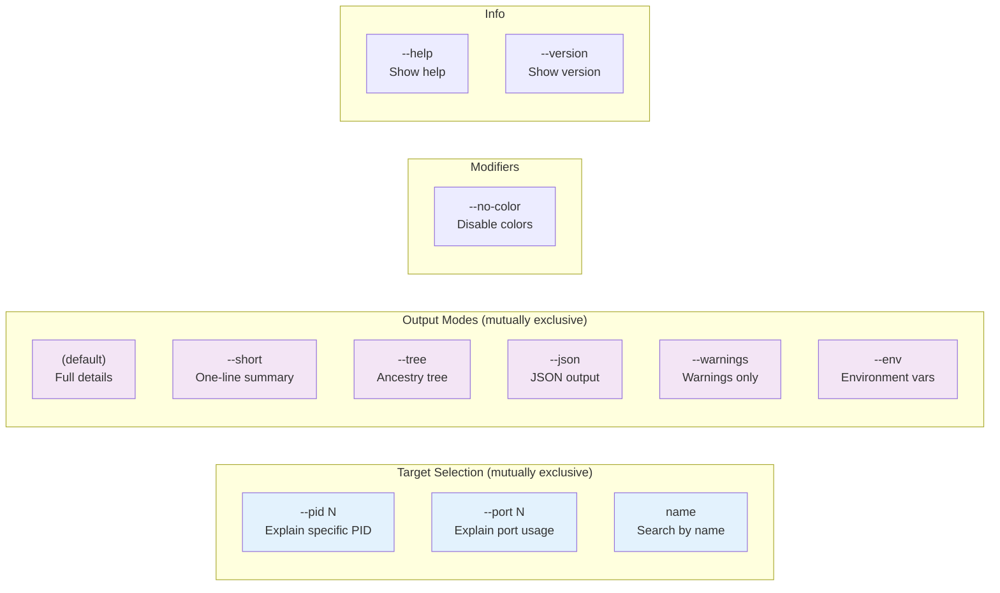

# CLI Flow

This diagram shows how witr processes command-line arguments and produces output.

```mermaid
flowchart TD
    Start([User runs witr]) --> ParseArgs[Parse Command Line Arguments]

    ParseArgs --> CheckVersion{--version?}
    CheckVersion -->|Yes| PrintVersion[Print Version Info] --> Exit1([Exit 0])
    CheckVersion -->|No| CheckHelp{--help?}

    CheckHelp -->|Yes| PrintHelp[Print Usage Help] --> Exit2([Exit 0])
    CheckHelp -->|No| CheckEnv{--env flag?}

    CheckEnv -->|Yes| EnvMode[Environment Mode]
    CheckEnv -->|No| StandardMode[Standard Mode]

    subgraph "Environment Mode"
        EnvMode --> BuildTarget1[Build Target from Args]
        BuildTarget1 --> ResolveTarget1[Resolve to PIDs]
        ResolveTarget1 --> CheckMulti1{Multiple PIDs?}
        CheckMulti1 -->|Yes| PrintMulti1[Print PID List] --> ExitMulti1([Exit 1])
        CheckMulti1 -->|No| ReadProc1[Read Process Info]
        ReadProc1 --> CheckJSON1{--json?}
        CheckJSON1 -->|Yes| OutputEnvJSON[Output JSON with Env]
        CheckJSON1 -->|No| OutputEnvStd[Output Env Variables]
    end

    subgraph "Standard Mode"
        StandardMode --> BuildTarget2[Build Target from Args]
        BuildTarget2 --> ResolveTarget2[Resolve to PIDs]
        ResolveTarget2 --> CheckError{Error?}
        CheckError -->|Yes| PrintError[Print Error + Suggestions] --> ExitErr([Exit 1])
        CheckError -->|No| CheckMulti2{Multiple PIDs?}
        CheckMulti2 -->|Yes| PrintMulti2[Print PID List] --> ExitMulti2([Exit 1])
        CheckMulti2 -->|No| BuildAncestry[Build Process Ancestry]
    end

    BuildAncestry --> DetectSource[Detect Source]
    DetectSource --> BuildResult[Build Result Object]

    BuildResult --> AddSocket{Port Query?}
    AddSocket -->|Yes| GetSocket[Get Socket State] --> AddResource
    AddSocket -->|No| AddResource[Get Resource Context]

    AddResource --> AddFile[Get File Context]
    AddFile --> GenerateWarnings[Generate Warnings]

    GenerateWarnings --> SelectOutput{Output Format?}

    SelectOutput -->|--json| OutputJSON[JSON Output]
    SelectOutput -->|--warnings| OutputWarn[Warnings Only]
    SelectOutput -->|--tree| OutputTree[Tree View]
    SelectOutput -->|--short| OutputShort[One-liner]
    SelectOutput -->|default| OutputStd[Standard Output]

    OutputJSON --> End([Exit 0])
    OutputWarn --> End
    OutputTree --> End
    OutputShort --> End
    OutputStd --> End
    OutputEnvJSON --> End
    OutputEnvStd --> End

    style Start fill:#e8f5e9
    style End fill:#e8f5e9
    style Exit1 fill:#e8f5e9
    style Exit2 fill:#e8f5e9
    style ExitErr fill:#ffebee
    style ExitMulti1 fill:#fff3e0
    style ExitMulti2 fill:#fff3e0
```

## Command Line Options

```mermaid
graph LR
    subgraph "Target Selection (mutually exclusive)"
        PID["--pid N<br/>Explain specific PID"]
        PORT["--port N<br/>Explain port usage"]
        NAME["name<br/>Search by name"]
    end

    subgraph "Output Modes (mutually exclusive)"
        STD["(default)<br/>Full details"]
        SHORT["--short<br/>One-line summary"]
        TREE["--tree<br/>Ancestry tree"]
        JSON["--json<br/>JSON output"]
        WARN["--warnings<br/>Warnings only"]
        ENV["--env<br/>Environment vars"]
    end

    subgraph "Modifiers"
        NOCOLOR["--no-color<br/>Disable colors"]
    end

    subgraph "Info"
        HELP["--help<br/>Show help"]
        VERSION["--version<br/>Show version"]
    end

    style PID fill:#e3f2fd
    style PORT fill:#e3f2fd
    style NAME fill:#e3f2fd
    style STD fill:#f3e5f5
    style SHORT fill:#f3e5f5
    style TREE fill:#f3e5f5
    style JSON fill:#f3e5f5
    style WARN fill:#f3e5f5
    style ENV fill:#f3e5f5
```
