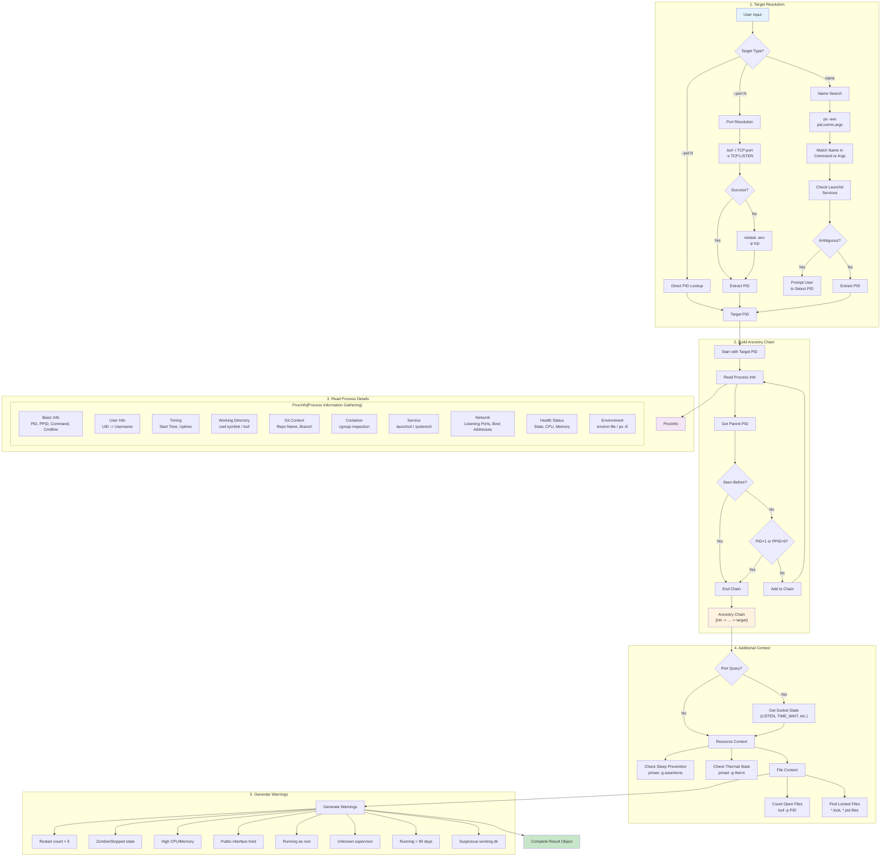
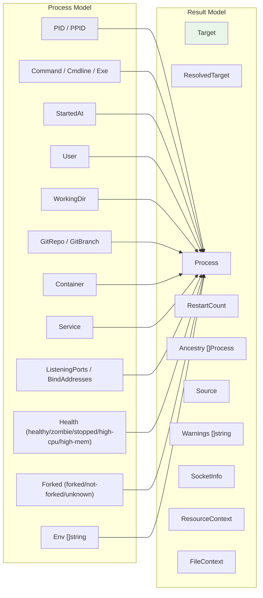

# Process Investigation Flow

This diagram shows how witr gathers information about a process.

```mermaid
flowchart TD
    subgraph "1. Target Resolution"
        Input["User Input"] --> TargetType{Target Type?}

        TargetType -->|"--pid N"| DirectPID[Direct PID Lookup]
        TargetType -->|"--port N"| PortLookup[Port Resolution]
        TargetType -->|"name"| NameLookup[Name Search]

        PortLookup --> UseLsof["lsof -i TCP:port<br/>-s TCP:LISTEN"]
        UseLsof --> LsofFail{Success?}
        LsofFail -->|No| UseNetstat["netstat -anv<br/>-p tcp"]
        LsofFail -->|Yes| ExtractPID1[Extract PID]
        UseNetstat --> ExtractPID1

        NameLookup --> SearchPS["ps -axo<br/>pid,comm,args"]
        SearchPS --> MatchName[Match Name in<br/>Command or Args]
        MatchName --> CheckLaunchd[Check Launchd<br/>Services]
        CheckLaunchd --> Ambiguous{Ambiguous?}
        Ambiguous -->|Yes| PromptUser[Prompt User<br/>to Select PID]
        Ambiguous -->|No| ExtractPID2[Extract PID]

        DirectPID --> PID[Target PID]
        ExtractPID1 --> PID
        ExtractPID2 --> PID
    end

    subgraph "2. Build Ancestry Chain"
        PID --> StartAncestry[Start with Target PID]
        StartAncestry --> ReadCurrent[Read Process Info]
        ReadCurrent --> GetPPID[Get Parent PID]
        GetPPID --> CheckLoop{Seen Before?}
        CheckLoop -->|Yes| EndChain[End Chain]
        CheckLoop -->|No| CheckRoot{PID=1 or PPID=0?}
        CheckRoot -->|Yes| EndChain
        CheckRoot -->|No| AddToChain[Add to Chain]
        AddToChain --> ReadCurrent
        EndChain --> Ancestry["Ancestry Chain<br/>[init -> ... -> target]"]
    end

    subgraph "3. Read Process Details"
        ReadCurrent --> ProcInfo

        subgraph "ProcInfo[Process Information Gathering]"
            direction TB
            Basic["Basic Info<br/>PID, PPID, Command, Cmdline"]
            User["User Info<br/>UID -> Username"]
            Timing["Timing<br/>Start Time, Uptime"]
            CWD["Working Directory<br/>cwd symlink / lsof"]
            Git["Git Context<br/>Repo Name, Branch"]
            Container["Container<br/>cgroup inspection"]
            Service["Service<br/>launchctl / systemctl"]
            Network["Network<br/>Listening Ports, Bind Addresses"]
            Health["Health Status<br/>State, CPU, Memory"]
            Env["Environment<br/>environ file / ps -E"]
        end
    end

    subgraph "4. Additional Context"
        Ancestry --> SocketCtx{Port Query?}
        SocketCtx -->|Yes| GetSocketState["Get Socket State<br/>(LISTEN, TIME_WAIT, etc.)"]
        SocketCtx -->|No| ResourceCtx

        GetSocketState --> ResourceCtx[Resource Context]
        ResourceCtx --> CheckSleep["Check Sleep Prevention<br/>pmset -g assertions"]
        ResourceCtx --> CheckThermal["Check Thermal State<br/>pmset -g therm"]

        ResourceCtx --> FileCtx[File Context]
        FileCtx --> CountFD["Count Open Files<br/>lsof -p PID"]
        FileCtx --> FindLocks["Find Locked Files<br/>*.lock, *.pid files"]
    end

    subgraph "5. Generate Warnings"
        FileCtx --> Warnings[Generate Warnings]
        Warnings --> W1["Restart count > 5"]
        Warnings --> W2["Zombie/Stopped state"]
        Warnings --> W3["High CPU/Memory"]
        Warnings --> W4["Public interface bind"]
        Warnings --> W5["Running as root"]
        Warnings --> W6["Unknown supervisor"]
        Warnings --> W7["Running > 90 days"]
        Warnings --> W8["Suspicious working dir"]
    end

    Warnings --> Result["Complete Result Object"]

    style Input fill:#e3f2fd
    style Result fill:#c8e6c9
    style Ancestry fill:#fff3e0
    style ProcInfo fill:#f3e5f5
```

## Data Gathered Per Process

```mermaid
graph LR
    subgraph "Process Model"
        direction TB
        P1["PID / PPID"]
        P2["Command / Cmdline / Exe"]
        P3["StartedAt"]
        P4["User"]
        P5["WorkingDir"]
        P6["GitRepo / GitBranch"]
        P7["Container"]
        P8["Service"]
        P9["ListeningPorts / BindAddresses"]
        P10["Health (healthy/zombie/stopped/high-cpu/high-mem)"]
        P11["Forked (forked/not-forked/unknown)"]
        P12["Env []string"]
    end

    subgraph "Result Model"
        direction TB
        R1["Target"]
        R2["ResolvedTarget"]
        R3["Process"]
        R4["RestartCount"]
        R5["Ancestry []Process"]
        R6["Source"]
        R7["Warnings []string"]
        R8["SocketInfo"]
        R9["ResourceContext"]
        R10["FileContext"]
    end

    P1 --> R3
    P2 --> R3
    P3 --> R3
    P4 --> R3
    P5 --> R3
    P6 --> R3
    P7 --> R3
    P8 --> R3
    P9 --> R3
    P10 --> R3
    P11 --> R3
    P12 --> R3

    style P1 fill:#e8eaf6
    style R1 fill:#e8f5e9
```
