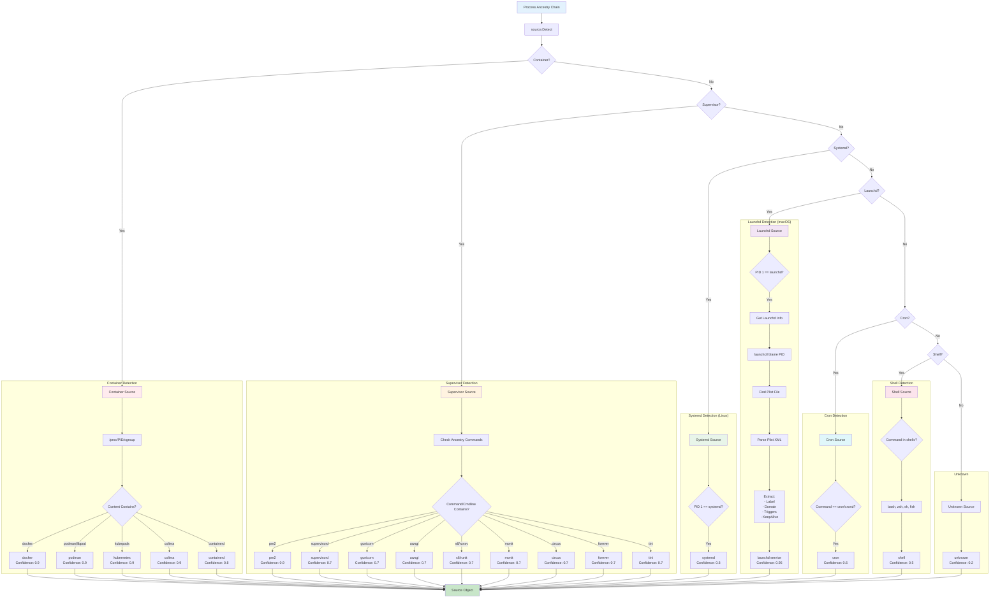
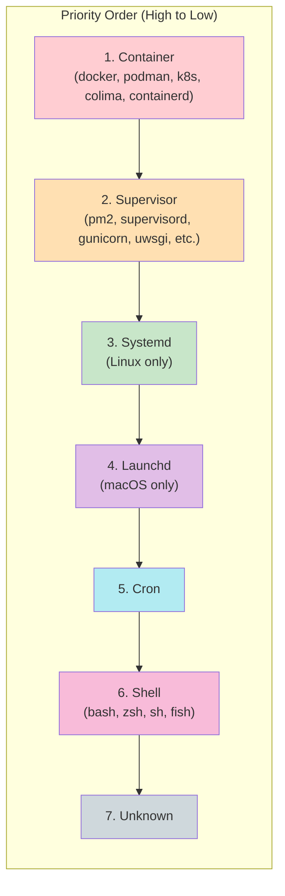
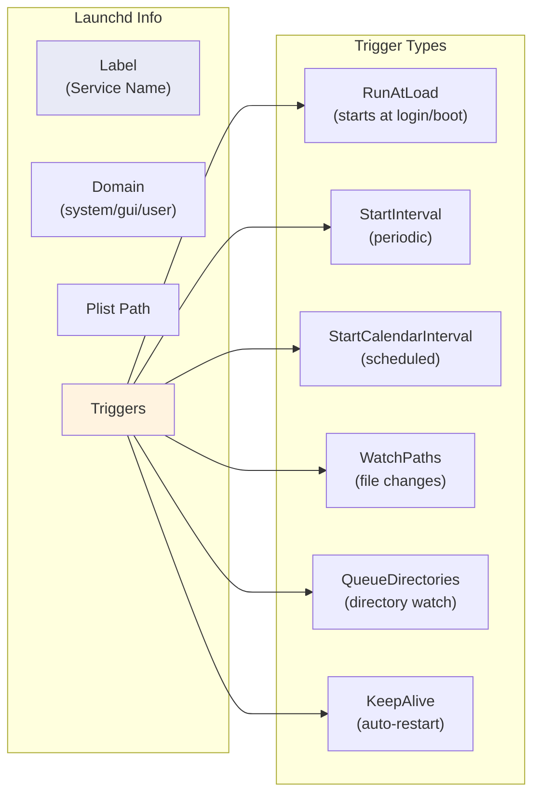

# Source Detection Flow

This diagram shows how witr determines what started a process.

## Detection Priority

Sources are checked in priority order. The first match wins:

## Launchd Detail Extraction

