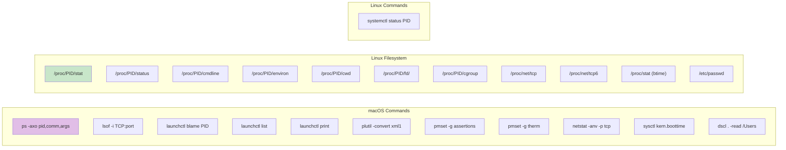

# Platform Support

This diagram shows how witr handles platform-specific implementations for macOS (Darwin) and Linux.

```mermaid
graph TB
    subgraph "Build Tags"
        Darwin["//go:build darwin"]
        Linux["//go:build linux"]
        Unsupported["//go:build !linux && !darwin"]
    end

    subgraph "Shared Code"
        Ancestry["ancestry.go"]
        Socket["socket.go"]
        DetectGo["detect.go"]
        SourceGo["source.go"]
        ContainerGo["container.go"]
        CronGo["cron.go"]
        ShellGo["shell.go"]
        SupervisorGo["supervisor.go"]
        NetworkGo["network.go"]
    end

    subgraph "macOS (Darwin) Implementation"
        direction TB
        D1["process_darwin.go<br/>Uses: ps, lsof"]
        D2["net_darwin.go<br/>Uses: lsof, netstat"]
        D3["fd_darwin.go<br/>Uses: lsof"]
        D4["boot_darwin.go<br/>Uses: sysctl"]
        D5["cmdline_darwin.go<br/>Uses: ps"]
        D6["user_darwin.go<br/>Uses: dscl"]
        D7["resource_darwin.go<br/>Uses: pmset"]
        D8["filecontext_darwin.go<br/>Uses: lsof, launchctl"]
        D9["socketstate_darwin.go<br/>Uses: netstat"]
        D10["launchd_darwin.go<br/>Uses: launchctl"]
        D11["systemd_darwin.go<br/>(stub - returns nil)"]
        D12["name_darwin.go<br/>Uses: ps, launchctl"]
        D13["port_darwin.go<br/>Uses: lsof, netstat"]
    end

    subgraph "Linux Implementation"
        direction TB
        L1["process_linux.go<br/>Uses: /proc filesystem"]
        L2["net_linux.go<br/>Uses: /proc/net/tcp"]
        L3["fd_linux.go<br/>Uses: /proc/PID/fd"]
        L4["boot_linux.go<br/>Uses: /proc/stat"]
        L5["cmdline_linux.go<br/>Uses: /proc/PID/cmdline"]
        L6["user_linux.go<br/>Uses: /etc/passwd"]
        L7["resource_linux.go<br/>(stub)"]
        L8["filecontext_linux.go<br/>Uses: /proc/PID/fd"]
        L9["socketstate_linux.go<br/>Uses: /proc/net/tcp"]
        L10["systemd_linux.go<br/>Uses: systemctl"]
        L11["launchd_linux.go<br/>(stub - returns nil)"]
        L12["name_linux.go<br/>Uses: /proc"]
        L13["port_linux.go<br/>Uses: /proc/net/tcp"]
    end

    Darwin --> D1
    Darwin --> D2
    Darwin --> D3
    Darwin --> D4
    Darwin --> D5
    Darwin --> D6
    Darwin --> D7
    Darwin --> D8
    Darwin --> D9
    Darwin --> D10
    Darwin --> D11
    Darwin --> D12
    Darwin --> D13

    Linux --> L1
    Linux --> L2
    Linux --> L3
    Linux --> L4
    Linux --> L5
    Linux --> L6
    Linux --> L7
    Linux --> L8
    Linux --> L9
    Linux --> L10
    Linux --> L11
    Linux --> L12
    Linux --> L13

    style Darwin fill:#e1bee7
    style Linux fill:#c8e6c9
    style Unsupported fill:#ffcdd2
```

## System Commands by Platform

## Platform-Specific Features

| Feature | macOS | Linux |
|---------|-------|-------|
| Process Info | `ps` command | `/proc` filesystem |
| Network Sockets | `lsof`, `netstat` | `/proc/net/tcp` |
| Init System | launchd | systemd |
| Container Detection | Command inspection | cgroup inspection |
| Resource Context | `pmset` (thermal, sleep) | Limited |
| Service Resolution | `launchctl` | `systemctl` |
| Plist Parsing | `plutil` + XML parse | N/A |
| User Resolution | `dscl` | `/etc/passwd` |
| Boot Time | `sysctl kern.boottime` | `/proc/stat btime` |
