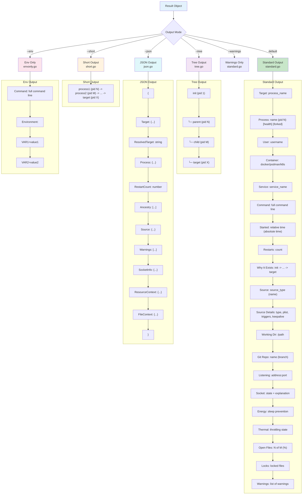
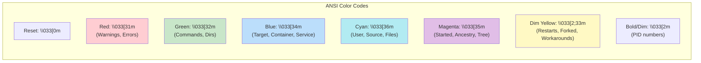

# Output Modes

This diagram shows the different output formats available in witr.



## Color Scheme



## Output Examples

### Standard Output
```
Target      : nginx

Process     : nginx (pid 1234) [healthy]
User        : www-data
Command     : nginx -g daemon off;
Started     : 2 days ago (Mon 2025-01-01 10:00:00 +0000)

Why It Exists :
  launchd (pid 1) -> nginx (pid 1234)

Source      : com.example.nginx (launchd)
              Type : Launch Daemon
              Plist : /Library/LaunchDaemons/com.example.nginx.plist
              Trigger : RunAtLoad (starts at login/boot)
              KeepAlive : Yes (restarts if killed)

Working Dir : /var/www
Listening   : 0.0.0.0:80
              0.0.0.0:443

Warnings    :
  - Process is listening on a public interface
```

### Short Output
```
launchd (pid 1) -> nginx (pid 1234)
```

### Tree Output
```
launchd (pid 1)
  └─ nginx (pid 1234)
```
