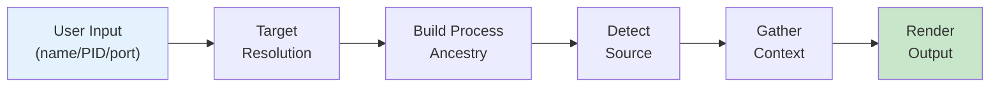

# witr Architecture Diagrams

This directory contains Mermaid diagrams documenting how witr works.

## Diagram Index

| # | Diagram | Description |
|---|---------|-------------|
| 1 | [Architecture Overview](./01-architecture-overview.md) | High-level package structure and component interactions |
| 2 | [CLI Flow](./02-cli-flow.md) | Command-line argument processing and execution flow |
| 3 | [Process Investigation Flow](./03-process-investigation-flow.md) | How process information is gathered |
| 4 | [Source Detection Flow](./04-source-detection-flow.md) | How the process origin is determined |
| 5 | [Platform Support](./05-platform-support.md) | macOS vs Linux implementation differences |
| 6 | [Output Modes](./06-output-modes.md) | Available output formats and their content |

## Quick Overview

**witr** ("Why Is This Running?") is a CLI tool that explains why a process is running on your system.

```
witr nginx          # Explain by name
witr --pid 1234     # Explain by PID
witr --port 8080    # Explain what's using a port
```

### Core Flow



### Supported Sources

| Source Type | Examples | Platform |
|-------------|----------|----------|
| Container | Docker, Podman, Kubernetes, Colima | Both |
| Supervisor | PM2, Supervisord, Gunicorn, uWSGI | Both |
| Init System | Launchd (macOS), Systemd (Linux) | Platform-specific |
| Scheduler | Cron | Both |
| Interactive | Bash, Zsh, Fish, Sh | Both |

### Output Formats

- **Standard** (default): Full detailed information with colors
- **Short** (`--short`): One-line ancestry chain
- **Tree** (`--tree`): Hierarchical tree view
- **JSON** (`--json`): Machine-readable output
- **Warnings** (`--warnings`): Only show warnings
- **Env** (`--env`): Environment variables only

## Viewing Diagrams

These diagrams use [Mermaid](https://mermaid.js.org/) syntax. You can view them:

1. **GitHub**: Renders Mermaid diagrams natively in markdown
2. **VS Code**: Use the "Markdown Preview Mermaid Support" extension
3. **Mermaid Live Editor**: Paste diagram code at https://mermaid.live
4. **CLI**: Use `mmdc` from `@mermaid-js/mermaid-cli`

```bash
# Install mermaid CLI
npm install -g @mermaid-js/mermaid-cli

# Convert to SVG
mmdc -i 01-architecture-overview.md -o architecture.svg
```
